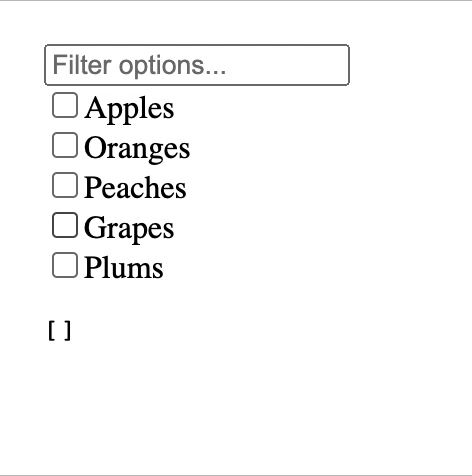

# compound-components

Example illustrations of the compound component pattern, in React and Angular.

End result:



## React

To run the React example:

```
cd react-example
yarn
yarn start
```

## Angular

To run the Angular example:

```
cd angular-example
yarn
yarn start
```
